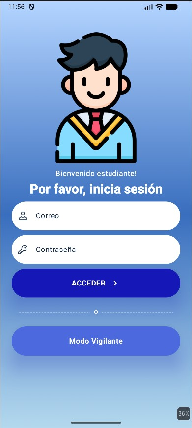
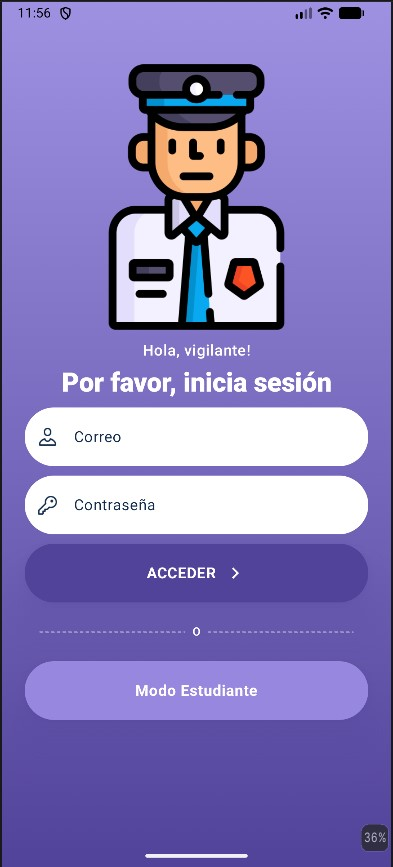

# Interfaz de Login en Kotlin

Creacion views de logueo y agregar una conexion a la api de Gandi

## 🛠️ Tecnologías

- **Kotlin**
- **Jetpack Compose**
- **Android Studio**
- **Material 3**

## 📱 Capturas de pantalla

